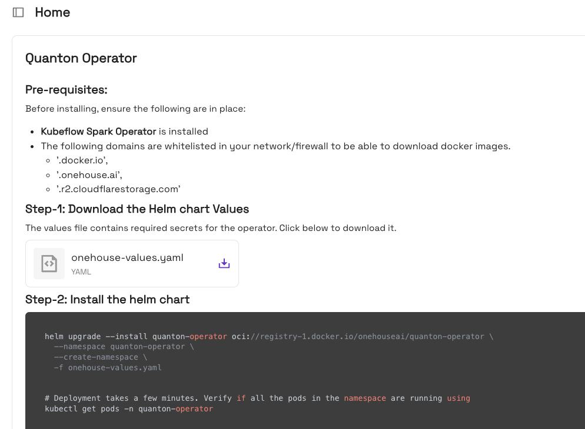

# Getting Started

This guide walks through setting up a local Kubernetes cluster with minikube, installing the Spark Operator and Quanton Operator, and running your first Quanton-powered Spark job.

> **Upgrading from v1.x?** This guide covers Quanton Operator v2.0.0. If upgrading from v1.x, see the [release notes](versioning.md) for breaking changes.

## Prerequisites

- [minikube](https://minikube.sigs.k8s.io/docs/start/) installed
- [Helm](https://helm.sh/docs/intro/install/) >= 3.x installed
- [Spark Operator](https://github.com/kubeflow/spark-operator) 2.x.x or later
- [kubectl](https://kubernetes.io/docs/tasks/tools/) installed
- Download `onehouse-values.yaml` from the Onehouse Quanton Operator [project homepage](https://cloud.onehouse.ai/\<organizationId\>/home) — (replace `<organizationId>` with your Onehouse organization ID)

  

- Docker is up and running, allowing 2 x 1024m containers

## Step 1: Start a Local Kubernetes Cluster

```bash
brew install minikube   # macOS; see minikube docs for other platforms
minikube start
```

Verify the cluster is running:

```bash
kubectl get nodes
```

## Step 2: Install the Spark Operator

Add the Spark Operator Helm repository and install it:

```bash
helm repo add spark-operator https://kubeflow.github.io/spark-operator
helm repo update

helm install spark-operator spark-operator/spark-operator \
  --namespace spark-operator \
  --create-namespace \
  --set "spark.jobNamespaces={default}"
```

Verify the Spark Operator pod is running:

```bash
kubectl get pods -n spark-operator
```

## Step 3: (Optional) Validate the Spark Operator

Submit the sample `SparkApplication` to confirm the Spark Operator is functioning:

```bash
kubectl apply -f examples/oss-spark-application.yaml
```

Wait for the job to complete:

```bash
kubectl get sparkapplications
```

Expected output:

```
NAME                    SUSPEND   STATUS      ATTEMPTS   AGE
spark-pi-java-example             COMPLETED   1          XXs
```

Check the result:

```bash
kubectl logs -f quanton-spark-pi-java-example-driver | grep -i "pi is"
```

```
Pi is roughly 3.1416568
```

## Step 4: Install the Quanton Operator

Install the Quanton Operator using the `onehouse-values.yaml` downloaded from the [Onehouse console](https://cloud.onehouse.ai/\<organizationId\>/home) (replace `<organizationId>` with your Onehouse organization ID):

```bash
helm upgrade --install quanton-operator oci://registry-1.docker.io/onehouseai/quanton-operator \
    --namespace quanton-operator \
    --create-namespace \
    --set "quantonOperator.jobNamespaces={default}" \
    -f onehouse-values.yaml
```

Verify the operator is running:

```bash
kubectl get pods -n quanton-operator
```

## Step 5: Submit a Quanton Spark Job

Apply the example `QuantonSparkApplication`:

```bash
kubectl apply -f examples/quanton-application.yaml
```

Monitor the driver pod (this may take 2-3 minutes while the Quanton image is pulled):

```bash
kubectl get pods -A | grep driver
```

Once the driver pod is running, check the output:

```bash
kubectl logs -f quanton-spark-pi-java-example-driver | grep -i "pi is"
```

Expected output:

```
Pi is roughly 3.1416568
```

## Step 6: Resubmitting a Job

To resubmit the same job, use one of the following approaches:

**Option A** — Delete and re-apply:

```bash
kubectl delete -f examples/quanton-application.yaml
kubectl apply -f examples/quanton-application.yaml
```

**Option B** — Change `metadata.name` to a unique value in the YAML before each submission.

```bash
kubectl create -f examples/quanton-application.yaml
```

## Step 7: Viewing the Spark UI

The Spark UI is available while a job is running. To access it locally, port-forward the driver pod:

```bash
kubectl port-forward <driver-pod-name> 4040:4040
```

Then open [http://localhost:4040](http://localhost:4040) in your browser.

> **Note:** The Spark UI is only available while the driver pod is alive. Once the job completes, the driver pod terminates and the UI becomes unavailable.

## Step 8: Cleaning up everything 


```bash
helm uninstall quanton-operator -n quanton-operator
kubectl delete crd quantonsparkapplications.onehouse.ai
kubectl delete crd quantonsparkapplications.quantonsparkoperator.onehouse.ai
```
Then you should be able to repeat from step 4.

## Next Steps

- [Configuration Reference](configurations.md) — Customize the operator for your environment
- [PySpark](pyspark.md) — Run PySpark jobs and select Python 3.9, 3.11, or 3.12
- [Airflow Provider](airflow.md) — Orchestrate Quanton jobs from Apache Airflow
- [Security](security.md) — Understand RBAC, mTLS, and token management
