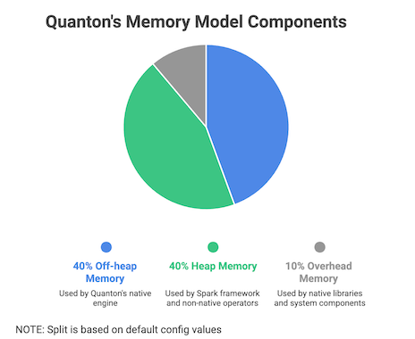
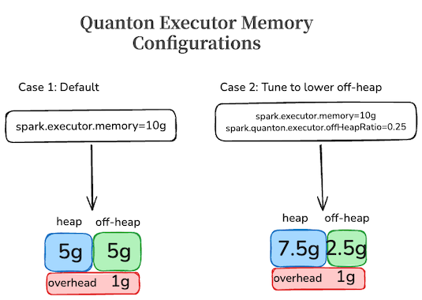

# Memory Management

Quanton offloads critical portions of query execution to its native engine whenever possible. The native engine operates using **off-heap memory**, enabling supported operations to execute outside the JVM heap and reducing garbage collection overhead.

However, not all operations can be offloaded to native execution. Some operators may not yet be implemented in native code and pure java code will not support native execution. In these cases, execution falls back to the standard Spark runtime, which uses JVM heap memory.

As a result, Quanton’s memory model consists of three components:

| Component | Description |
|-----------|-------------|
| **Off-heap Memory** | Used by Quanton’s native engine to execute supported operators outside the JVM heap for improved performance and reduced GC pressure. |
| **Heap Memory** | Used by the standard Spark framework and by operators that cannot be executed natively. |
| **Overhead Memory** | Used by native libraries and system-level components, including compression libraries such as **gzip** and **zstd**. |

  

> Proper configuration of these three memory regions is important to ensure stable and efficient execution of Quanton workloads.

---

## Configuring Memory Sizes

With Quanton, the driver memory is purely heap and the memory configurations remain same as Apache Spark. In the case of executors, the memory 
needs to be split across heap and off-heap. For improved usability, Quanton derives its memory layout from existing Spark executor 
memory configuration and splits it between JVM heap and native off-heap memory.

### Configuration Inputs

Quanton uses the following configurations for memory:

| Property                              | Description                                                                                                                                                  | Default |
|---------------------------------------|--------------------------------------------------------------------------------------------------------------------------------------------------------------|---------|
| `spark.driver.memory`                 | Same as apache spark, Quanton uses this value to configure the heap size of the driver.                                                                      | `1g`    |
| `spark.executor.memory`               | Total executor memory before splitting. Quanton uses this value as the total available heap and off-heap executor memory.                                    | `1g`    |
| `spark.quanton.executor.offHeapRatio` | Fraction of executor memory reserved for Quanton off-heap execution.                                                                                         | `0.5`   |
| `spark.executor.memoryOverheadFactor`       | Executor overhead memory, calculated as `spark.executor.memoryOverhead` or `executorMemory * spark.executor.memoryOverheadFactor`, with a minimum of 384 MB. | `0.1`   |

### How Quanton Calculates Memory

Quanton reads the executor memory config and splits it between JVM heap and off-heap memory using the configured ratio.
We use examples to better illustrate how Quanton configures the memory.

Case 1: If default configs are used, and the executor memory (spark.executor.memory) is set to 10g, then Quanton will equally 
split the 10 GB across heap and off-heap as shown in the figure below.

Case 2: In the case that the spark job needs more heap memory due to higher number of stages running in java, the memory ratio
(configured via spark.quanton.executor.offHeapRatio) is set to 0.25. Quanton will now split the 10g as 7.5 GB for heap and 2.5 GB for off-heap.

  

